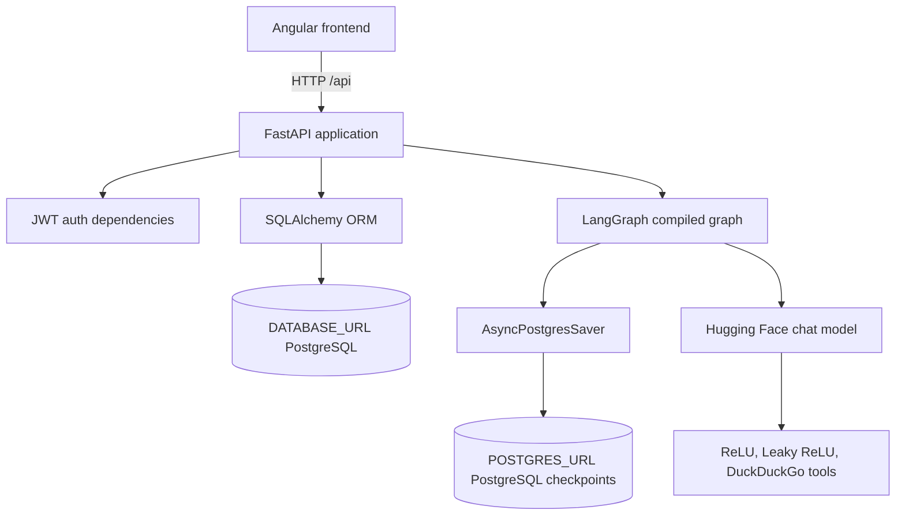
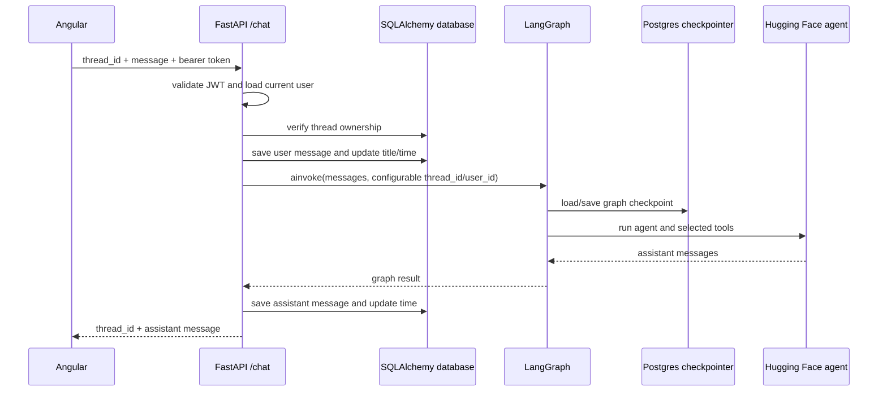

# Backend Wiring Guide

This document explains how `main.py` connects the FastAPI application to authentication, SQLAlchemy, LangGraph, PostgreSQL, and the Angular frontend.

## 1. High-level architecture



The backend has two persistence responsibilities:

- **Application data:** users, threads, and saved chat messages are managed by SQLAlchemy using `DATABASE_URL`.
- **Agent state:** LangGraph checkpoints are managed by `AsyncPostgresSaver` using `POSTGRES_URL`.

These URLs may point to the same PostgreSQL server, but they serve different integrations and use different drivers. `DATABASE_URL` is normally a SQLAlchemy URL such as `postgresql+psycopg://...`; `POSTGRES_URL` is used by the async LangGraph checkpointer and is normally `postgresql://...`.

## 2. Startup and application lifecycle

`main.py` creates the FastAPI application with a lifespan handler:

```python
app = FastAPI(title="ReLU LangGraph Chat API", lifespan=lifespan)
```

When the server starts, `lifespan()` runs in this order:

1. `initialize_agent()` creates the Hugging Face chat model and LangChain agent once.
2. `AsyncPostgresSaver.from_conn_string(POSTGRES_URL)` opens the LangGraph checkpoint connection.
3. `checkpointer.setup()` creates or verifies the checkpoint tables.
4. `create_graph(checkpointer)` compiles the graph with persistent checkpoint support.
5. `yield` keeps the application running while the graph and connection are available.
6. When the server shuts down, the async checkpointer context closes.

The compiled graph is assigned to the module-level `graph` variable. The `/chat` endpoint uses this shared graph for requests.

During the FastAPI lifespan startup, this async block creates the application tables if they do not already exist:

```python
async with engine.begin() as connection:
    await connection.run_sync(Base.metadata.create_all)
```

The tables come from `models.py`: `users`, `threads`, and `messages`.

## 3. Module wiring

### `main.py`

Owns the HTTP API. It:

- loads environment variables and CORS settings;
- configures FastAPI and CORS;
- starts the agent and LangGraph checkpointer;
- defines authentication, thread, message, and chat routes;
- coordinates database writes with graph execution.

### `database.py`

Creates the asynchronous SQLAlchemy engine and session factory:

```text
DATABASE_URL -> AsyncEngine -> AsyncSession -> get_db() -> route dependency
```

`get_db()` yields one `AsyncSession` to a route and closes it when the request finishes, so database I/O can be awaited without blocking the event loop.

### `models.py`

Defines the relational application data:

```text
User 1 ─── * Thread 1 ─── * Message
```

Deleting a user cascades to their threads, and deleting a thread cascades to its messages.

### `schemas.py`

Defines Pydantic request and response contracts. FastAPI validates incoming JSON before the route body runs and serializes route results according to each `response_model`.

### `auth.py`

Provides:

- password hashing and verification with `pwdlib`/Argon2;
- access and refresh JWT creation;
- refresh-token validation;
- `get_current_user`, a FastAPI dependency that extracts the bearer token, validates it, loads the user, and rejects invalid requests.

### `agent.py`

Builds the AI portion of the application:

1. `initialize_agent()` configures `HuggingFaceEndpoint` and wraps it in `ChatHuggingFace`.
2. The agent receives the `relu`, `leaky_relu`, and `internet_search` tools.
3. `GraphState` stores the conversation messages.
4. The graph runs `START -> agent -> END`.
5. `create_graph(checkpointer)` compiles that graph with the supplied LangGraph checkpointer.

## 4. Authentication flow

### Register

`POST /auth/register`:

1. Look up the requested email.
2. Reject it if already registered.
3. Hash the password.
4. Insert the new `User`.
5. Return an access token and refresh token.

The plaintext password is never stored.

### Login

`POST /auth/login`:

1. Look up the user by email.
2. Verify the submitted password against `password_hash`.
3. Return new access and refresh tokens.

### Protected routes

Routes that accept `current_user: User = Depends(get_current_user)` require:

```http
Authorization: Bearer <access-token>
```

The dependency validates the JWT and loads the user before the route executes. Thread queries then include `Thread.user_id == current_user.id`, preventing one user from reading or changing another user's threads.

### Refresh

`POST /auth/refresh` validates a refresh token, confirms that the user still exists, and issues a new access-token/refresh-token pair.

## 5. Thread and message flow

### Create a thread

`POST /threads` creates an empty thread owned by the authenticated user. Its initial title is `New Chat`, and its timestamps are set to the current UTC time.

### List threads

`GET /threads` returns only the current user's threads, ordered by most recently updated.

### Read messages

`GET /threads/{thread_id}/messages` first verifies that the thread belongs to the authenticated user, then returns its messages in ascending creation order.

### Delete a thread

`DELETE /threads/{thread_id}` performs the same ownership check before deleting the thread. SQLAlchemy's cascade configuration removes its messages as well.

## 6. Chat request flow

The Angular `ChatService` sends:

```http
POST /api/chat
Content-Type: application/json
Authorization: Bearer <access-token>

{
  "thread_id": "<thread-id>",
  "message": "Calculate ReLU(-5)"
}
```

The backend processes `/chat` as follows:



In code, the LangGraph configuration is:

```python
config = {
    "configurable": {
        "thread_id": thread.id,
        "user_id": current_user.id,
    }
}
```

`thread_id` identifies the conversation checkpoint. `user_id` is included as request context. The application database separately stores the user and assistant messages so the frontend can reload them through `/threads/{thread_id}/messages`.

If the thread still has the title `New Chat`, the first user message is truncated to 50 characters and used as its title.

After graph execution, `main.py` searches the returned message list backward for the last message whose type is `ai`, stores its content as an assistant `Message`, and returns it to the frontend.

## 7. Route map

| Method | Route | Auth | Responsibility |
|---|---|---:|---|
| `GET` | `/` | No | Health-style root response |
| `POST` | `/auth/register` | No | Create user and issue tokens |
| `POST` | `/auth/login` | No | Verify credentials and issue tokens |
| `POST` | `/auth/refresh` | No | Rotate access and refresh tokens |
| `GET` | `/auth/me` | Yes | Return the authenticated user |
| `POST` | `/threads` | Yes | Create a thread |
| `GET` | `/threads` | Yes | List the user's threads |
| `GET` | `/threads/{thread_id}/messages` | Yes | Load a user's thread messages |
| `POST` | `/chat` | Yes | Save a user message, run the agent, save and return the answer |
| `DELETE` | `/threads/{thread_id}` | Yes | Delete an owned thread and its messages |

## 8. Required environment variables

The backend reads values from the environment or a local `.env` file:

| Variable | Used by | Purpose |
|---|---|---|
| `DATABASE_URL` | `database.py` | SQLAlchemy application database connection |
| `POSTGRES_URL` | `main.py` / LangGraph | Async checkpoint database connection |
| `JWT_SECRET` | `auth.py` | Signs and verifies JWTs; required at import time |
| `JWT_ALGORITHM` | `auth.py` | JWT algorithm; defaults to `HS256` |
| `JWT_EXPIRE_MINUTES` | `auth.py` | Access-token lifetime; defaults to 60 minutes |
| `JWT_REFRESH_EXPIRE_DAYS` | `auth.py` | Refresh-token lifetime; defaults to 30 days |
| `HF_Token` | `agent.py` | Hugging Face authentication token |
| `HF_MODEL` | `agent.py` | Hugging Face model; has a default |
| `HF_PROVIDER` | `agent.py` | Optional Hugging Face provider |
| `CORS_ORIGINS` | `main.py` | Comma-separated allowed frontend origins |

## 9. Important implementation notes

- `graph` is `None` until the FastAPI lifespan startup completes. Requests should be served only after startup has initialized the graph.
- `initialize_agent()` is guarded so repeated calls do not recreate the model agent.
- The application uses async SQLAlchemy route dependencies and an asynchronous LangGraph invocation in `/chat`.
- The user message is committed before the graph runs. The assistant message is committed after the graph returns. A graph failure can therefore leave the user message saved without an assistant response.
- Thread ownership is checked before reading messages, chatting, or deleting, which is the main authorization boundary for conversation data.
- CORS is configured from `CORS_ORIGINS`; in production it should contain the deployed frontend origin rather than a broad wildcard.
